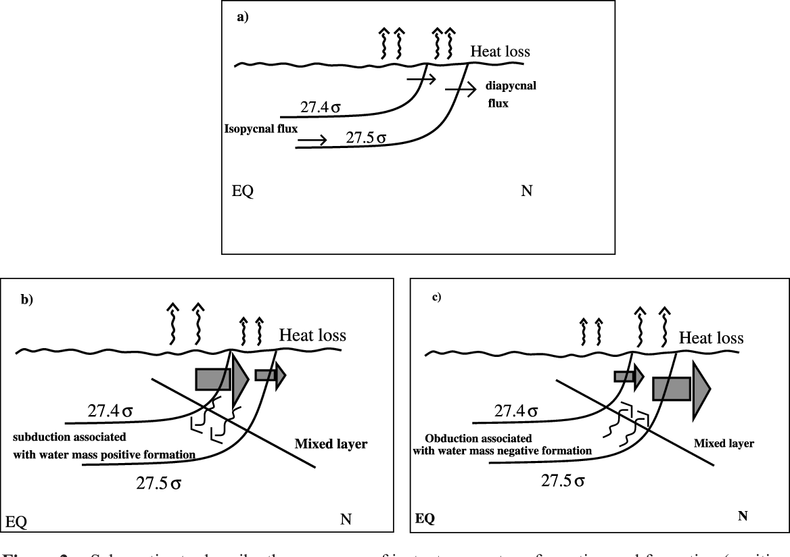

# Documentation for SMOS toolbox
## An analysis of watermass (trans)formation from space
### Overview
The SMOS toolbox is a novel numerical model which derives information about the distribution and properties of watermasses from air-sea fluxes utilising satellite date.

The study was driven by a need to use salinity data taken from SMOS in order to better understand the water cycle and it's temporal variability through understanding of watermasses in the worlds oceans.

The oceans can be thought of as comprising of multiple bodies of water each having their own unique temperature and salinity characteristcs. When and where these unique bodies of water appear (formation) or move away from a specific location (destruction) can be related to the exchange of heat and freshwater with the atmosphere.
The transformation is the mass flow of water through a constant property surface (i.e the mass flux per unit area) and the formation is the difference in transformation between two successive constant property surfaces.

|  |
|:--:|
|  The transformation in this figure is given by a diapycnal flux or the mass flux of water through a constant density surface (a). A positive or negative formation can result if the mass flux accross one of the constat density surfaces is greater (b) or smaller (c) than through the subsequent density surface, respectively. |

It does this in the following ways:

	-

### Technical Information
The code included in this repository highlights the work done at the European Space Agency in order to develop a model which computes and analyses water mass formation using satellite data.

The goals of the model are to output (trans)formation data in:

	- denisty space
	- temperature - salinity space
	- geographic space

### Methodology

